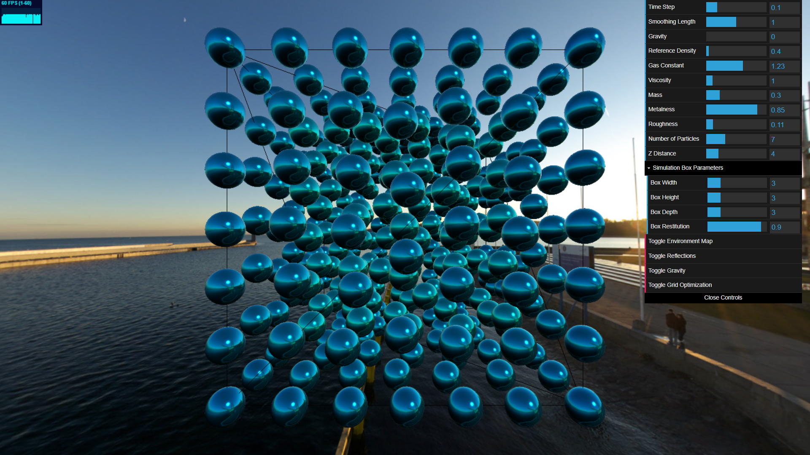

# Smoothed Particle Hydrodynamics Implementation in Three.js

This repository contains an implementation of a Smoothed Particle Hydrodynamics (SPH) fluid simulation using Three.js. The simulation models fluid dynamics by calculating interactions between particles based on physical properties such as density, pressure, and viscosity. The code provides a real-time visualization of the fluid system, allowing users to adjust simulation parameters and observe the behavior of the fluid in a 2D or 3D environment.




## Table of Contents

- [Smoothed Particle Hydrodynamics Implementation in Three.js](#smoothed-particle-hydrodynamics-implementation-in-threejs)
  - [Table of Contents](#table-of-contents)
  - [What is Smoothed Particle Hydrodynamics?](#what-is-smoothed-particle-hydrodynamics)
  - [What is a smoothing kernel?](#what-is-a-smoothing-kernel)
  - [What is the math involved?](#what-is-the-math-involved)
    - [Kernel Function](#kernel-function)
    - [Density](#density)
    - [Pressure](#pressure)
    - [Pressure Force](#pressure-force)
    - [Viscosity Force](#viscosity-force)
    - [Gravity Force](#gravity-force)
  - [Code Implementation](#code-implementation)
    - [Core Features](#core-features)
    - [Simulation Parameters](#simulation-parameters)
    - [Main Rendering Loop](#main-rendering-loop)
    - [Paticle Class](#paticle-class)
    - [Main Three.js Components Used](#main-threejs-components-used)
  - [Code Optimization](#code-optimization)
    - [Grid-based updates](#grid-based-updates)
    - [Instanced Mesh](#instanced-mesh)
  - [Conclusions](#conclusions)

## What is Smoothed Particle Hydrodynamics?

Smoothed Particle Hydrodynamics (SPH) is a computational method used to simulate the dynamics of fluids and gasses. It is a mesh-free, Lagrangian method which tracks fluid particles as they move through space and time, with each particle containing properties such as mass, position, and velocity. A distinctive feature of SPH is its use of a smoothing kernel, which estimates field values like density and pressure across the fluid, enhancing the method’s stability and accuracy.

## What is a smoothing kernel?

The smoothing kernel is a mathematical function that determines how much influence a particle has on its neighboring points in space. Its purpose is to smooth out the properties of particles over a defined area, ensuring that the physical quantities are not calculated just at discrete points (where particles are located) but rather across a continuum space.

## What is the math involved?

### Kernel Function

As a kernel function, we use the Cubic Spline Kernel introduced in the late 1970s for SPH. This kernel became a standard tool for simulating fluid dynamics due to its smooth and compact shape, which makes it ideal for approximating fluid behavior.

### Density

The density of a particle is computed by summing the contributions of all neighboring particles' masses within a certain radius, known as the smoothing length. The mass of each neighbor is weighted by the kernel function W.

### Pressure

Once the density is computed, the pressure of each particle is calculated using the Tait equation. The purpose of this equation is to provide a relationship between pressure and density that ensures the fluid behaves realistically under compression and expansion. It helps in maintaining incompressibility to some extent, which is a desirable property for simulating liquids.

### Pressure Force

The pressure force calculates the force exerted on a particle due to the pressure difference between it and its neighbors. The negative sign indicates that the force acts to reduce pressure differences, promoting stability in the fluid system. The gradient provides the direction in which the pressure force acts.

### Viscosity Force

The viscosity force represents the force exerted on a particle due to the velocity differences between it and its neighboring particles. This force helps simulate the internal friction within the fluid, ensuring that particles move in a smooth, coherent manner, which is crucial for realistic fluid behavior.

### Gravity Force

The gravity force is applied uniformly to all particles in the simulation. It is calculated by multiplying the mass of each particle by the gravitational acceleration. This force ensures that all particles experience a constant downward pull, simulating the effect of gravity (if activated).

## Code Implementation

The code implements a 2D/3D Smoothed Particle Hydrodynamics (SPH) fluid simulation using Three.js. The simulation models fluid dynamics by calculating interactions between particles based on physical properties that can be defined using a GUI and a bounding box used to simulate the interaction of particles with a wall.

### Core Features

- Handles both 2D and 3D simulations
- Adjustable physics parameters in real-time
- Camera controls
- Real-time reflections of particles
- Ambient reflections
- Real-time adjustable bounding box dimensions
- Grid-Based optimization
- Instanced Mesh optimization

### Simulation Parameters

```javascript
const simulationParams = {
  boxWidth: 8, // Width of the simulation box
  boxHeight: 4, // Height of the simulation box
  boxDepth: 4, // Depth of the simulation box
  numberOfParticles: 8, // Number of particles in each dimension
  particlesMetalness: 0.3, // Metalness of the particles
  particlesRoughness: 0.3, // Roughness of the particles
  particlesDimensions: 0.15, // Diameter of the particles
  particleSpacing: 0.3, // Initial spacing between the particles
  zSimulation: 7, // Z position of the camera

  ThirdDimension: true, // Set to false to simulate in 2D
  enableReflections: false, // Set to true to enable reflections
  InstancedMesh: true, // Set to true to use an InstancedMesh
  useGridOptimization: true, // Set to true to use grid optimization
  showEnvironment: false, // Set to true to show an environment map

  BoxRestitution: 0.9, // Restitution of the box walls,
  particlesMass: 0.3, // Mass of the particles,
  smoothingLength: 0.3, // Radius of the smoothing kernel,
  referenceDensity: 1, // Target density for the fluid
  gasConstant: 0.5, // Gas constant for the equation of state
  viscosity: 1, // Viscosity of the fluid
  gravity: 8, // Gravity force applied to the particles
  timeStep: 0.1, // Simulation time step
};
```

### Main Rendering Loop

```javascript
function animate() {
  requestAnimationFrame(animate);

  calculateDensityAndPressureOptimized(
    particles,
    simulationParams.smoothingLength,
    simulationParams.referenceDensity,
    simulationParams.gasConstant
  );
  calculateForcesOptimized(
    particles,
    simulationParams.smoothingLength,
    simulationParams.referenceDensity,
    simulationParams.gravity
  );

  updateParticles(particles, simulationParams.timeStep);
  computeReflections(particles);

  stats.update();
  renderer.render(scene, camera);
}
```

### Paticle Class

```javascript
class Particle {
  constructor(position, velocity, index) {
    this.position = position;
    this.velocity = velocity;
    this.acceleration = new THREE.Vector3(0, 0, 0);
    this.mass = simulationParams.particlesMass;
    this.density = 0;
    this.pressure = 0;
    this.forces = new THREE.Vector3(0, 0, 0);
    this.index = index;
  }
}
```

### Main Three.js Components Used

- `THREE.WebGLRenderer`: For rendering the 3D scene.
- `THREE.Scene`: To create a container for objects, lights, and cameras.
- `THREE.PerspectiveCamera`: For the camera setup.
- `THREE.AmbientLight`: To add ambient lighting to the scene.
- `THREE.DirectionalLight`: To add directional lighting to the scene.
- `THREE.CubeCamera`: To capture reflections from the particle position.
- `THREE.MeshStandardMaterial`: For the material of individual particles.
- `THREE.MeshPhysicalMaterial`: For the material of the instanced mesh particles.
- `THREE.MeshBasicMaterial`: For the material of the simulation box with wireframe.
- `THREE.EquirectangularReflectionMapping`: For mapping the environment texture.
- `THREE.InstancedMesh`: For rendering multiple instances of geometry efficiently.
- `THREE.Object3D`: For creating a dummy 3D object to update the InstancedMesh.
- `THREE.LinearMipmapLinearFilter`: Texture filter for generating mipmaps.
- `THREE.Mesh`: For creating mesh objects from geometry and material.
- `THREE.Object3D.updateMatrix`: To update the transformation matrix of a 3D object.

## Code Optimization

### Grid-based updates

To optimize the computation of forces, a grid optimization has been implemented, which enhances the performance and scalability of the fluid simulation. The optimization involves spatially partitioning the simulation space into a grid, where each cell contains a list of particles within its boundaries. The cell size is determined by the smoothing length, ensuring particles within the same or neighboring cells can be considered for force calculations. During each simulation step, particles are assigned to grid cells based on their positions. For density and pressure calculations, each particle's density is computed by summing contributions from particles in its cell and adjacent cells using the SPH kernel function, and pressure is then calculated based on the density. Similarly, for force calculations, particles interact only with those in their cell and neighboring cells, reducing the original O(n^2) computational complexity.

### Instanced Mesh

Instanced Mesh optimization is a crucial feature in this fluid simulation, using the Three.js's InstancedMesh class to efficiently render a large number of particles. This approach significantly reduces the computational load on the GPU by minimizing the number of draw calls required, thus enhancing the overall performances. All particles share the same geometry and material, defined once and reused across instances. This avoids the overhead of creating and managing individual mesh objects for each particle.

## Conclusions

The implementation showcases a Smoothed Particle Hydrodynamics (SPH) fluid simulation using Three.js, demonstrating both graphics and computational aspects of fluid dynamics.  
To create an even more realistic representation of fluids, additional techniques such as Marching Cubes could be implemented. Marching Cubes would allow for the generation of a continuous surface from the particle data, providing a more accurate and visually appealing depiction of fluid surfaces. This, combined with advanced rendering techniques and optimizations, would enhance the realism and performance of the simulation.
